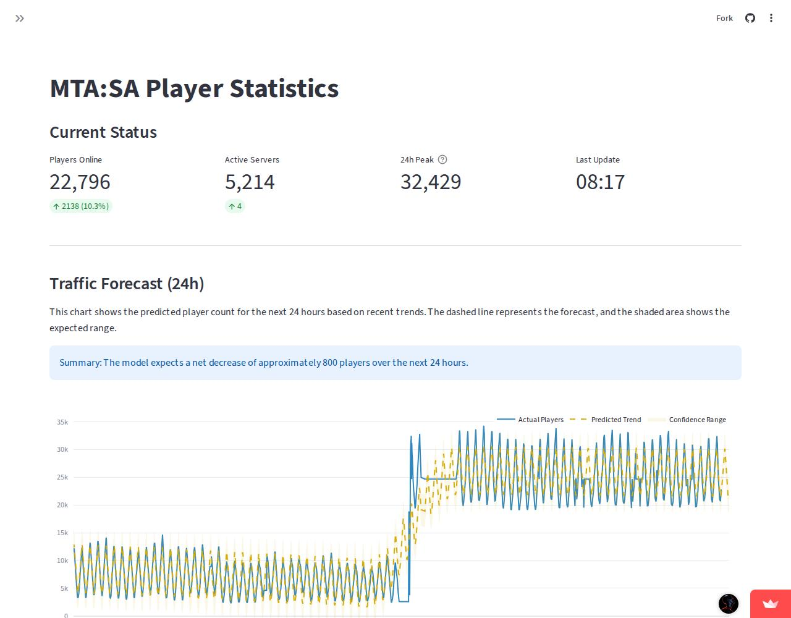

# MTA:SA Player Activity Tracker

An automated end-to-end data pipeline for monitoring and forecasting the Multi Theft Auto: San Andreas players activity.

🚀 **Explore the data:** [https://mta-sa-analytics.streamlit.app/](https://mta-sa-analytics.streamlit.app/)

---

## Live Dashboard Snapshot
*This image is automatically updated every day via GitHub Actions to reflect the current telemetry.*

---

## Project Overview
This system performs automated telemetry ingestion of concurrent player counts and server availability. It utilizes time-series forecasting to project infrastructure load and identifies peak activity patterns through temporal density analysis.

## Architecture

1.  **Extraction:** Python-based ingestion service fetching real-time data from the MTA masterlist API.
2.  **Storage:** Git-based persistent storage (CSV) managed via automated CI/CD cycles.
3.  **Analytics:** On-the-fly data transformation and regression modeling during app initialization.
4.  **Presentation:** Web dashboard deployed on **Streamlit Cloud**.

## Tech Stack
* **Language:** Python 3.12
* **Analytics:** Pandas, Facebook Prophet
* **Visualization:** Plotly
* **Infrastructure:** GitHub Actions (Automation), Streamlit Cloud (Hosting)

---
*Data Source: multitheftauto.com*
